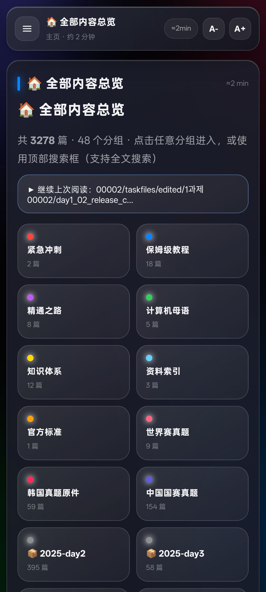
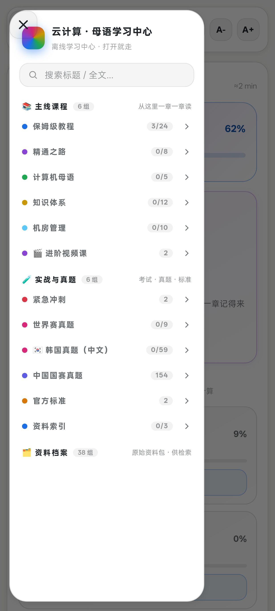
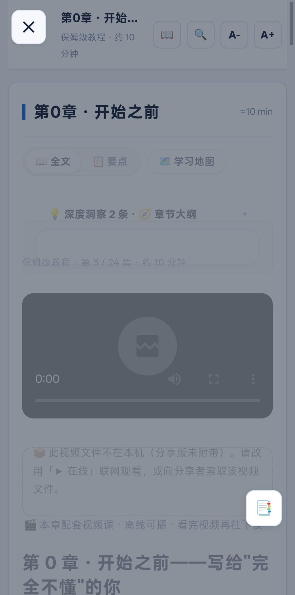

# 云计算学习中心 · WorldSkills Cloud Computing 中文学习资料库

> **山东工业技师学院 · 学生自学学习资料**（独立整理开发，欢迎交流）
>
> 面向**世界技能大赛云计算项目（Skill 39）**选手与自学者的开源中文学习平台。
> 20 章保姆级教程 + 62 集视频课 + 全中文国际赛题库 + 全功能离线 App——**一个仓库，从零基础到竞赛水平**。





---

##  包含什么

| 模块 | 内容 | 位置 |
|------|------|------|
|  **保姆级中文教程**（20 章 + 附录） | 从"什么是文件"讲到 AWS/容器/自动化/安全/机房管理/装机/编译原理/锐捷云平台，每步带命令、输出示例、排错指南与练习答案 | [`docs/tutorial/`](docs/tutorial/) |
|  **视频课**（62 集） | 机房管理 15 集 · 保姆级教程 18 集 · 进阶专题 29 集；App 内全离线播放 | [Releases 下载](https://github.com/TaiMaBenJi/worldskills-cloud/releases/latest) |
|  **精通之路**（7 篇） | 从"级联话术"到母语级能力的训练体系：全景地图 / 五级阶梯 / 领域修炼 / 架构模式 / 全平台 / 365 天训练系统 | [`docs/mastery/`](docs/mastery/) |
|  **计算机母语之路**（5 篇） | 《计算机系统要素》《C Primer Plus》《思考快与慢》《编译原理》《高级编译器》五书共生学习体系（24 个月路线） | [`docs/cs-mastery/`](docs/cs-mastery/) |
|  **知识体系**（12 章） | Linux / 网络 / 企业服务 / OpenStack / AWS / 容器 / IaC / 可观测 / 安全 / 前沿 / 竞赛 / 认证 | [`docs/knowledge/`](docs/knowledge/) |
|  **机房管理修炼体系**（11 篇） | 从供电制冷到 PXE 装机、应急演练、职业路线的完整机房之路 | [`docs/room/`](docs/room/) |
|  **韩国赛题中文库**（59 份） | 2021–2025 韩国技能竞赛云计算真题：题面 + 评分标准（全中文翻译，评分命令可直接照用） | [`exam/korea-zh/`](exam/korea-zh/) |
|  **模拟实训室** | 22 个实战场景 + 4 套模拟赛卷，浏览器内真操作、自动评分 | [`lab/`](lab/) |
|  **资源库**（760 条） | B站精选学习视频：装机 / 计算机 / 编译原理 / 进阶，支持搜索 / 已看 / 收藏 | 内置 App 与 study.html |
|  **离线学习中心** | 单文件 `study.html`：3200+ 篇资料全文检索、阅读进度记忆、扁平简约界面、完全离线 | [Releases 下载](https://github.com/TaiMaBenJi/worldskills-cloud/releases/latest) |
|  **安卓 App（411 MB · 唯一版本）** | 62 集视频课 + 教程 / 题库 / 资源库 / 实训室全部内置，安装即用、完全离线 | [Releases 下载](https://github.com/TaiMaBenJi/worldskills-cloud/releases/latest) |
|  **Windows 版（13 MB）** | 单文件 `CloudStudy.exe`，双击自动释放学习中心并用浏览器打开，免安装 | [Releases 下载](https://github.com/TaiMaBenJi/worldskills-cloud/releases/latest) |
|  **全技能精通库（55 篇）** | 世界技能大赛六大领域约 50 个赛项的项目总纲：赛制、能力域、精通路线、训练体系、自测清单 | [`multiskill/`](multiskill/) |

##  四种使用方式

**① 装 App（推荐手机党）**
从 [**Releases 页面**](https://github.com/TaiMaBenJi/worldskills-cloud/releases/latest) 下载 `CloudStudy-Full.apk`（唯一完整版 · 411 MB）→ 安装 → 打开「云计算学习」。
> 视频课、题库、资源库、实训室全部内置，无需联网；安装时系统提示"未知来源/风险应用"属正常侧载提示。

**② 浏览器打开学习中心**
从 [**Releases 页面**](https://github.com/TaiMaBenJi/worldskills-cloud/releases/latest) 下载 `study.html`（13 MB 单文件）→ 任意浏览器直接打开。

**③ Windows 双击即用**
从 [**Releases 页面**](https://github.com/TaiMaBenJi/worldskills-cloud/releases/latest) 下载 `CloudStudy.exe` → 双击 → 自动打开学习中心（免安装，内嵌最新界面）。

**④ 直接读文档**
从 [`docs/tutorial/00-开始之前`](docs/tutorial/00-开始之前-零基础先读我.md) 开始，按顺序阅读。

##  目录结构

```
worldskills-cloud/
├── app/  # 学习引擎源码（段位体系 / 资源库）· APK 见 Releases
├── lab/  # 模拟实训室引擎（22 场景 + 4 套模拟赛卷）
├── docs/  # 教程与知识体系（Markdown 源）
│  ├── tutorial/  #  20 章保姆级教程 + 附录
│  ├── mastery/  #  精通之路 7 篇
│  ├── cs-mastery/  #  计算机母语之路 5 篇
│  ├── knowledge/  #  知识体系 12 章
│  ├── room/  #  机房管理修炼体系 11 篇
│  ├── sprint/  #  冲刺作战手册
│  └── official/  #  WSOS 官方标准（中 / 英）
├── exam/
│  └── korea-zh/  # 韩国赛题中文翻译（题面 + 评分标准）
├── tools/  # 构建工具链（页面生成器 / APK 构建 / 小工具）
├── video-factory/  # 视频课生成流水线（Markdown → 视频课）
├── video-ext/  # 进阶视频课总览
└── assets/  # 截图
```

##  自行构建

### 重新生成学习中心（study.html）

```bash
# 环境：Python 3 + Pillow；依赖 Markdown 库
pip install markdown pillow
# 将 docs/exam 下的资料按 tools/build_liquid.py 内的路径约定放置后：
python3 tools/build_liquid.py
```

### 构建安卓 App

`tools/rebuild_full.sh`（唯一完整版 · 一键构建脚本）展示完整流程：
1. 生成 `study.html` → 放入 `assets/`
2. 编写 `AndroidManifest.xml` + 最小 WebView Activity（smali 模板见 `tools/apk-template/`）
3. 用 `smali.jar` 汇编 classes.dex
4. 用 `aapt2 compile/link` 打包资源与页面
5. 合并 dex → 用 `uber-apk-signer` 签名（或你的自有密钥）
6. `adb install -r` 安装

> 模板（`tools/apk-template/`）包含可直接复用的 Manifest、MainActivity.smali 与图标。

##  内容来源与致谢

- **本项目**：由**山东工业技师学院学生**在自学过程中独立整理与开发，教程与方法论均为原创编写，欢迎交流指正
- **官方**：WorldSkills Occupational Standards（WSOS 2026 上海）
- **赛题**：韩国技能竞赛公开资料、各国选手公开训练仓库等**公开渠道**整理
- **教程与方法论**：本项目原创编写
- 资料仅供学习交流，相关版权归原出处所有；如涉版权问题请提 Issue 处理。

##  License

- 代码与工具：**MIT**（见 [LICENSE](LICENSE)）
- 原创文档与教程：**CC BY-NC-SA 4.0**（署名-非商业性使用-相同方式共享）

##  路线图

- [x] 保姆级教程 20 章 + 附录（含装机、编译原理、锐捷云平台）
- [x] 视频课 62 集（机房管理 / 保姆级教程 / 进阶专题）
- [x] 资源库：760 条 B站精选
- [x] 段位体系 + 模拟实训室（22 场景 / 4 套模拟赛卷）
- [x] 界面重塑 v3（扁平简约、白卡片、分区导航、沉浸阅读）
- [x] Windows 版 CloudStudy.exe（单文件免安装）
- [ ] 收录更多国家/地区赛题（中 / 英 / 日 / 葡…）
- [ ] B站课程下载队列收尾（约 15 门大课）

---

**如果这个项目帮到了你，给一个  Star 就是最好的支持。**
